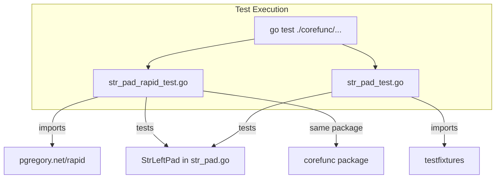

# Design Document: StrLeftPad Property-Based Tests

## Overview

This design covers the addition of a property-based test file (`corefunc/str_pad_rapid_test.go`) that uses `pgregory.net/rapid` to verify algebraic invariants of the `StrLeftPad` function. The tests complement the existing table-driven tests, benchmarks, and fuzz tests by asserting universal properties that must hold across all valid inputs.

The `StrLeftPad` function has a small, well-defined contract:

* Input: a string, a target width (int), and an optional single-byte pad character (default `0x20`)
* Output: a left-padded string where `len(output) == max(len(str), max(padWidth, 0))`
* Invariants: original string preserved as suffix, padding composed entirely of the pad character

This makes it an ideal candidate for property-based testing — the input space is large (arbitrary strings × arbitrary widths × 256 byte values) but the behavioral contract is precise and universally quantified.

## Architecture



The test file lives alongside the existing tests in the `corefunc` package, using white-box access (same package). Each test function calls `rapid.Check(t, ...)` which integrates with `testing.T` for standard `go test` discovery and reporting.

## Components and interfaces

### File: `corefunc/str_pad_rapid_test.go`

**Package declaration:** `package corefunc`

**Imports:**

```go
import (
    "strings"
    "testing"

    "pgregory.net/rapid"
)
```

### Generator definitions

Generators are defined as helper functions or inline within each test to produce random inputs conforming to the constraints specified in the requirements.

| Generator        | Rapid API                                    | Range        | Purpose                        |
|------------------|----------------------------------------------|--------------|--------------------------------|
| `strGen`         | `rapid.StringOfN(rapid.Byte(), 0, 1024, -1)` | 0–1024 bytes | Random input strings           |
| `padWidthGen`    | `rapid.IntRange(0, 2048)`                    | 0–2048       | Positive pad widths            |
| `negPadWidthGen` | `rapid.IntRange(-1000, 0)`                   | -1000–0      | Non-positive pad widths        |
| `padCharGen`     | `rapid.ByteRange(0x01, 0xFF)`                | 1–255        | Non-zero pad characters        |
| `fullPadCharGen` | `rapid.Byte()`                               | 0–255        | Full byte range pad characters |

Note: `rapid.StringOfN(rapid.Byte(), min, max, -1)` generates a string of random bytes with length between `min` and `max`. The `-1` means no exact length constraint. For controlled length, `rapid.IntRange` sets the length and `rapid.StringOfN` uses that.

### Test function signatures

Each property maps to one test function:

```go
func TestStrLeftPad_OutputLength(t *testing.T)
func TestStrLeftPad_ContentPreservation(t *testing.T)
func TestStrLeftPad_PadCharCorrectness(t *testing.T)
func TestStrLeftPad_Idempotence(t *testing.T)
func TestStrLeftPad_Identity(t *testing.T)
func TestStrLeftPad_MonotonicGrowth(t *testing.T)
```

### Integration pattern

Each test function follows this structure:

```go
func TestStrLeftPad_PropertyName(t *testing.T) {
    // Feature: str-leftpad-property-tests, Property N: description
    rapid.Check(t, func(t *rapid.T) {
        // Draw random inputs
        str := rapid.StringOfN(rapid.Byte(), 0, 1024, -1).Draw(t, "str")
        padWidth := rapid.IntRange(0, 2048).Draw(t, "padWidth")
        padChar := rapid.ByteRange(0x01, 0xFF).Draw(t, "padChar")

        // Execute
        result := StrLeftPad(str, padWidth, padChar)

        // Assert property
        // ...
    })
}
```

`rapid.Check` runs the property function with at least 100 generated inputs by default. For the metamorphic property tests (Requirement 6), the iteration count is increased to 1000 via `rapid.MakeCheck` configuration.

### Rapid check configuration for higher iteration count

For tests requiring 1000+ iterations (Requirement 6.4):

```go
func TestStrLeftPad_MonotonicGrowth(t *testing.T) {
    rapid.Check(t, func(t *rapid.T) {
        // ...
    })
}
```

Rapid's default is 100 iterations. To achieve 1000, pass the `-rapid.checks=1000` flag at test time or use an environment variable. The design relies on the default (100) for most properties and documents how to increase iterations for higher-coverage runs.

### Property-to-Test mapping

| Property             | Test Function                        | Key Assertion                                                  |
|----------------------|--------------------------------------|----------------------------------------------------------------|
| Output Length        | `TestStrLeftPad_OutputLength`        | `len(result) == max(len(str), max(padWidth, 0))`               |
| Content Preservation | `TestStrLeftPad_ContentPreservation` | `strings.HasSuffix(result, str)`                               |
| Pad Char Correctness | `TestStrLeftPad_PadCharCorrectness`  | All prefix bytes == padChar (or space for default)             |
| Idempotence          | `TestStrLeftPad_Idempotence`         | `StrLeftPad(result, w, c) == result`                           |
| Identity             | `TestStrLeftPad_Identity`            | `result == str` when `len(str) >= padWidth` or `padWidth <= 0` |
| Monotonic Growth     | `TestStrLeftPad_MonotonicGrowth`     | `StrLeftPad(str, w+1, c) == string(c) + StrLeftPad(str, w, c)` |

## Data models

No persistent data models. All test data is ephemeral, generated per-run by Rapid's generators. The function under test operates on primitive types:

| Parameter    | Type     | Constraints                            |
|--------------|----------|----------------------------------------|
| `str`        | `string` | Arbitrary byte content, 0–1024 bytes   |
| `padWidth`   | `int`    | -1000 to 2048                          |
| `padChar`    | `byte`   | 0x00–0xFF (optional, defaults to 0x20) |
| Return value | `string` | Left-padded result                     |

## Correctness properties

_A property is a characteristic or behavior that should hold true across all valid executions of a system — essentially, a formal statement about what the system should do. Properties serve as the bridge between human-readable specifications and machine-verifiable correctness guarantees._

### Property 1: output length invariant

_For any_ string `str`, any non-negative `padWidth`, and any `padChar`, `len(StrLeftPad(str, padWidth, padChar))` shall equal `padWidth` when `len(str) < padWidth`, and shall equal `len(str)` when `len(str) >= padWidth`. Equivalently: `len(output) == max(len(str), padWidth)`.

**Validates: Requirements 1.1, 1.2, 1.4.**

### Property 2: content preservation (Suffix)

_For any_ string `str`, any `padWidth` (positive, zero, or negative), and any `padChar`, the output of `StrLeftPad(str, padWidth, padChar)` shall end with `str` as a suffix. That is, `strings.HasSuffix(output, str)` is always true.

**Validates: Requirements 2.1.**

### Property 3: pad character correctness

_For any_ string `str`, any `padWidth > len(str)`, and any `padChar`, every byte in the padding prefix `output[0 : padWidth-len(str)]` shall equal `padChar`. When no `padChar` is specified, every byte in the padding prefix shall equal `0x20` (space).

**Validates: Requirements 2.2, 5.1, 5.2, 5.3.**

### Property 4: idempotence

_For any_ string `str`, any `padWidth`, and any `padChar`, applying `StrLeftPad` twice with the same parameters produces the same result as applying it once: `StrLeftPad(StrLeftPad(str, w, c), w, c) == StrLeftPad(str, w, c)`.

**Validates: Requirements 3.2.**

### Property 5: identity (No-Op)

_For any_ string `str` and any `padChar`:

* When `len(str) >= padWidth`, `StrLeftPad(str, padWidth, padChar) == str`
* When `padWidth <= 0`, `StrLeftPad(str, padWidth, padChar) == str`

This subsumes the zero-width, negative-width, and already-long-enough cases.

**Validates: Requirements 3.1, 3.3, 4.1, 4.2, 4.4, 5.4, 6.2.**

### Property 6: monotonic growth (Metamorphic)

_For any_ string `str`, any `padWidth > len(str)`, and any `padChar`, increasing `padWidth` by one prepends exactly one `padChar` byte: `StrLeftPad(str, padWidth+1, padChar) == string(padChar) + StrLeftPad(str, padWidth, padChar)`.

**Validates: Requirements 6.1, 6.3, 6.5.**

## Error handling

`StrLeftPad` does not return errors — it handles edge cases by returning the input unchanged. The property tests verify this graceful behavior:

* **Negative padWidth**: Function treats as 0, returns input unchanged. Verified by Property 5 (Identity).
* **Zero padWidth**: Returns input unchanged. Verified by Property 5.
* **Empty string input**: Valid input producing a string of only pad characters. Covered by all properties via generators that include `len(str) == 0`.
* **Null byte as padChar (0x00)**: Valid single-byte character. Generators include the full byte range to cover this.

No panics or errors are expected from `StrLeftPad` for any combination of inputs. If the function panics during a `rapid.Check` run, Rapid captures it as a test failure with a minimal shrunk counterexample.

## Testing strategy

### Approach: dual testing (Property + Table-Driven)

The property tests complement (not replace) the existing test infrastructure:

| Test Type          | File                        | Purpose                              |
|--------------------|-----------------------------|--------------------------------------|
| Table-driven       | `str_pad_test.go`           | Specific known input/output pairs    |
| Benchmarks         | `str_pad_test.go`           | Performance regression detection     |
| Fuzz tests         | `str_pad_test.go`           | Crash/panic discovery                |
| **Property tests** | **`str_pad_rapid_test.go`** | **Universal invariant verification** |

### Property-Based testing configuration

* **Library**: `pgregory.net/rapid`
* **Minimum iterations**: 100 per property (Rapid default)
* **Extended iterations**: Pass `-rapid.checks=1000` for higher coverage runs (Requirement 6.4)
* **Shrinking**: Automatic — Rapid shrinks failing inputs to minimal counterexamples
* **Determinism**: Each run uses a random seed; failures are reproducible via the seed reported in output

### Test tagging convention

Each test function includes a comment referencing its design property:

```go
// Feature: str-leftpad-property-tests, Property 1: Output Length Invariant
```

### Running tests

```bash
# Run all corefunc tests including property tests
go test ./corefunc/...

# Run only property tests
go test ./corefunc/... -run "TestStrLeftPad_(OutputLength|ContentPreservation|PadCharCorrectness|Idempotence|Identity|MonotonicGrowth)"

# Run with increased iterations
go test ./corefunc/... -rapid.checks=1000
```

### Dependency addition

Add `pgregory.net/rapid` to `go.mod`:

```bash
go get pgregory.net/rapid
```

This is a test-only dependency (imported only in `_test.go` files) so it does not affect the provider binary.
